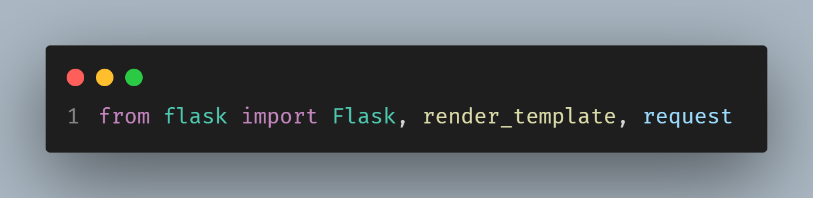
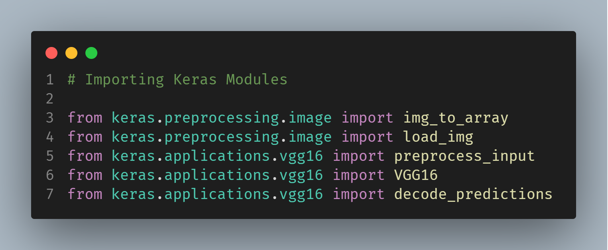
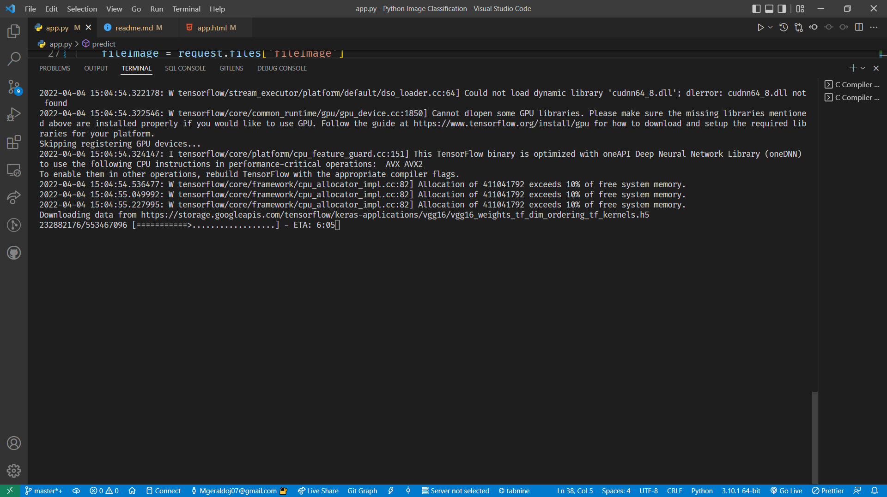
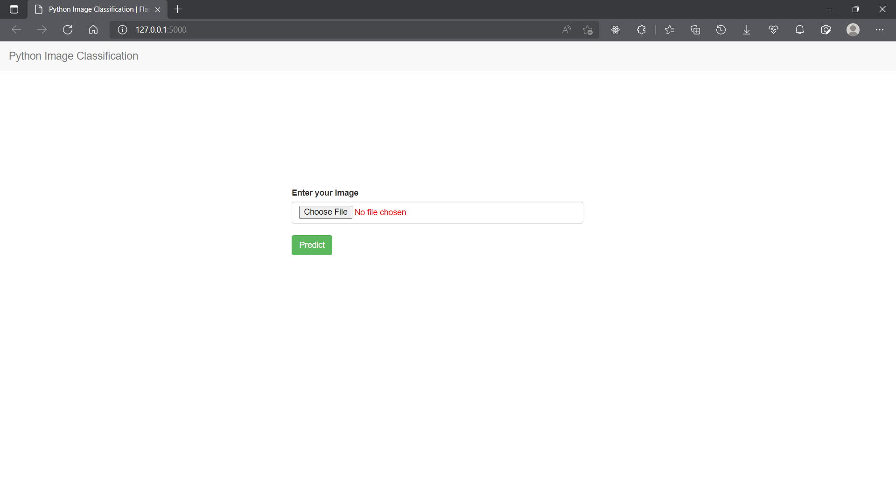
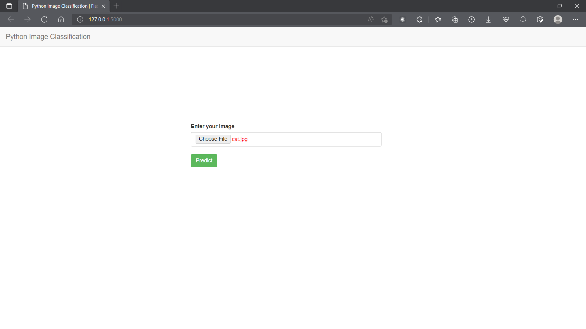
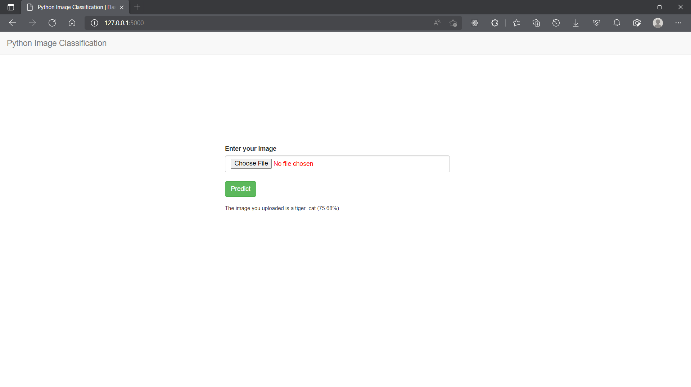

# Image Classification in Python

**Implementing image classification in Flask using Keras.**

The VGG16 is a convolution neural network model architecture that is the best classifier for images till today. This project implements the classifier through Keras. This appplication was written in Python. It also utilizes the <a href="https://flask.palletsprojects.com/en/2.1.x/">Flask Microframework</a>, as the server to render a template, and pass the submitted file to the prediction model. It also uses <a href="https://keras.io/">Keras</a> modules to perform image classification.

## Requirements 

* **Python 3.5+**
* **Pip (For installing modules)**
* **Flask** <a href="https://flask.palletsprojects.com/en/2.1.x/">Download</a> 
* **Tensorflow**
* **Keras Modules**

## Installation

### (Plain Set Up)

Go ahead an clone this specific repository. You could do this through the command below:

    > git clone https://github.com/grayoj/Python-Image-Classification.git

Then navigate to the directory. If you use VSCode, you could avoid interacting with the terminal.

Run the following commands in the directory:

    > pythom -m flask run

### (Full Set Up)

Go ahead an clone this specific repository. You could do this through the command below:

    > git clone https://github.com/grayoj/Python-Image-Classification.git

To install Python, download <a href="python.org">here</a>. If you already have Python 3.5 installed, you may proceed to the next steps below:

You will notice this line of code in the ``app.py`` file:

To ensure the modules would be imported on your system, into the project, run the following command:

    > pip install flask

That would install flask on your local machine.
Next step is to install the Keras Modules, and packages required. Run the following command:

    > pip install keras

If you use Pylance, it should validate the imports above in the ``app.py``. i.e show no errors, of modules missing. Modules being installed:

You would have to install Tensorflow as well.

    > pip install tensorflow

You are set. Now let's dial in to a localhost port.

    > python -m flask run

Viola, the application should load sucessfully. If there are any errors, ensure you installed the modules properly.

    Http://127.0.0.1:5000 

Don't worry if you notice a sudden download process. Tensorflow would begin to download dependencies for the VGG16 Covolutional Neural network model.

## Prediction in action

Now, the fun part. This should have loaded open:

Let's see whether our model can predict what this animal is:
The picture used is in the repository. You could use other images, and have fun.

Now let's input it

Click on predict

Our model predicted a tiger cat! Epic.

## More Information

Reach out to me if you have questions or suggestions. Would love to connect.

****
Twitter: @geraldabuchi

# Python-Image-Classification - MIT License
Flask, Keras, Tensorflow, VGG16
